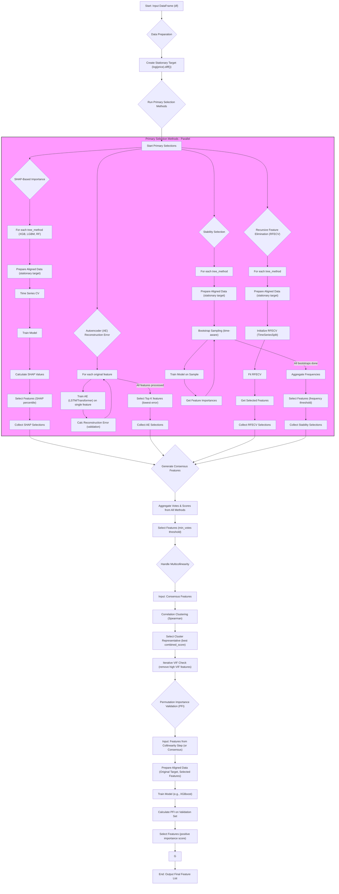

# Bitcoin Price Forecasting Feature Selection Workflow

This document provides a comprehensive workflow diagram for the feature selection strategy used in the Bitcoin price forecasting project.

B1 --> B2["Split df into Train & Validation Sets"];

## Complete Feature Selection Workflow

Here are the guidelines for robust feature selection using tree-based methods and autoencoders, tailored for your Bitcoin price forecasting project:

**Comprehensive Guidelines for Robust Feature Selection**

**I. Foundational Pre-processing (Critical Prerequisites)**

1.  **Handle Non-Stationarity (Absolutely Essential):**
    *   **Action:** Transform your target variable (Bitcoin closing price) and all time-series exogenous variables to achieve stationarity *before* any feature selection.
        *   Common methods: Differencing (e.g., `price_t - price_{t-1}`), log transformations followed by differencing (`log(price_t) - log(price_{t-1})`).
        *   Consider fractional differencing if simple differencing over-corrects or induces too much noise.
    *   **Verification:** Use statistical tests like Augmented Dickey-Fuller (ADF) or Kwiatkowski-Phillips-Schmidt-Shin (KPSS) to confirm stationarity.
    *   **Why:** Applying selection methods to non-stationary data leads to spurious correlations and unreliable feature importance.

2.  **Strict Temporal Data Splitting (Prevent Look-Ahead Bias):**
    *   **Action:** Divide your data chronologically into training, validation (for feature selection and hyperparameter tuning), and a final hold-out test set.
    *   **Tool:** Use `sklearn.model_selection.TimeSeriesSplit` for all cross-validation procedures within your feature selection process. This ensures that training folds always precede validation folds.
    *   **Why:** Prevents future information from leaking into the past, which would give an overly optimistic and unrealistic assessment of feature predictive power.

3.  **Data Scaling:**
    *   **Action:** Scale your features. This is particularly important for autoencoders and can also benefit some tree-based models.
        *   Common methods: `MinMaxScaler` (to \[0, 1]) or `StandardScaler` (zero mean, unit variance).
    *   **Procedure:** Fit scalers *only* on the training data of each `TimeSeriesSplit` fold and then use the *fitted* scaler to transform the corresponding validation fold (and later, the test set using the scaler fitted on the full training set).
    *   **Why:** Ensures consistent feature magnitudes, aiding model convergence and preventing features with larger values from dominating.

4.  **Address Multicollinearity (Recommended):**
    *   **Action (Optional but good practice before tree-based methods if not solely relying on SHAP):**
        *   Calculate a correlation matrix for your features.
        *   Use Variance Inflation Factor (VIF) to identify highly collinear features.
    *   **Strategy:** If severe multicollinearity is detected, consider removing one of the highly correlated features or combining them (e.g., via PCA on that small subset, though this creates new features).
    *   **Why:** While tree models can handle some multicollinearity for prediction, feature importance scores (especially default Gini importance) can be unreliably distributed among collinear features. SHAP values are generally more robust to this.

**II. Robust Feature Selection Workflow**

This workflow leverages tree-based methods and autoencoders within a stability-enhancing framework.

1.  **Core Principle: Time-Aware Iterative Selection & Validation:**
    *   All selection steps must be performed within the `TimeSeriesSplit` cross-validation framework.

2.  **Component A: Tree-Based Feature Selection (e.g., XGBoost, LightGBM, Random Forest)**
    *   **Model Training:** Within each `TimeSeriesSplit` fold, train a tree-based model on the training portion to predict your (stationary) target variable.
    *   **Importance Metric - SHAP Values (Recommended):**
        *   Calculate SHAP values for each feature on the validation portion of the fold. SHAP values provide more consistent and reliable feature importance estimates compared to default impurity-based importances.
        *   Compute the mean absolute SHAP value for each feature across all instances in the validation fold.
    *   **Aggregation:** Store the mean absolute SHAP values for each feature from each fold.

3.  **Component B: Autoencoder-Based Feature Analysis (for selecting *original* features)**
    *   **Objective:** Identify original features that are most crucial for the autoencoder to reconstruct the input data accurately.
    *   **Architecture:** Design an autoencoder (e.g., a simple MLP-based autoencoder or LSTM-based if features have strong temporal dependencies *within themselves* that you want to capture for reconstruction).
    *   **Training:** Train the autoencoder on the training portion of each `TimeSeriesSplit` fold to minimize reconstruction error.
    *   **Feature Importance Derivation (choose one or more):**
        1.  **Reconstruction Error Sensitivity:** For each feature in the validation data of a fold:
            *   Temporarily corrupt the feature (e.g., by permuting its values or replacing it with noise).
            *   Measure the increase in the autoencoder's reconstruction error for the validation set.
            *   Features causing a larger increase in error are considered more important.
        2.  **Gradient-Based (More complex):** Analyze the gradients of the reconstruction error with respect to the input features.
    *   **Aggregation:** Store the importance scores for each feature from each fold.

4.  **Component C: Stability Selection (Enhancing Robustness)**
    *   **Procedure:**
        1.  For each `TimeSeriesSplit` fold:
            *   Perform bootstrapping: Create multiple (e.g., 30-50) bootstrap samples of the *training data* for that fold.
            *   For each bootstrap sample, run your chosen feature selection method(s) (e.g., tree-based with SHAP, autoencoder analysis).
            *   Record the top N features or the importance scores for all features.
        2.  **Aggregation across Bootstraps:** For each fold, calculate the frequency with which each feature is selected (if using a fixed N) or the average importance score across all bootstrap runs.
    *   **Cross-Fold Aggregation:** After processing all `TimeSeriesSplit` folds, average the stability-enhanced importance scores (or selection frequencies) for each feature across all folds.
    *   **Selection Criterion:** Select features that consistently exhibit high importance or are frequently selected across folds and bootstrap runs (e.g., features selected in >80% of bootstrap runs and present in the top X% of features in most folds).

5.  **Combining Evidence (If using both Tree-Based and Autoencoder methods):**
    *   **Intersection:** Select features deemed important by *both* methods. This is conservative but yields high-confidence features.
    *   **Rank Aggregation:** Rank features based on SHAP values and autoencoder importance. Combine ranks (e.g., average rank) and select top features.
    *   **Weighted Scoring:** Assign weights to the importance scores from each method and combine them.

**III. Final Validation of the Selected Feature Set**

1.  **Permutation Feature Importance (on a Held-Out Validation Set):**
    *   **Action:**
        1.  Train your *final candidate forecasting model* (this could be one of the tree-based models used for selection, or your intended deep learning model) using the selected feature subset on the *entire training set*.
        2.  Evaluate this model on a separate, *held-out validation set* (not the final test set) using a relevant metric (e.g., RMSE, MAE, or a financial metric like Sharpe Ratio if predicting returns).
        3.  For each feature in the selected subset:
            *   Shuffle (permute) the values of only that feature in the validation set.
            *   Re-evaluate the trained model on this shuffled validation set.
            *   The drop in performance indicates the feature's importance.
    *   **Why:** Directly measures a feature's contribution to the *specific model's* predictive performance on unseen data. Features causing a significant performance drop when permuted are valuable.

2.  **Out-of-Sample Performance with Downstream Model:**
    *   The ultimate validation is the performance of your final Bitcoin forecasting DL model using the selected features on the *held-out test set*. Compare this against benchmarks (e.g., model with all features, model with features selected by simpler methods).

**IV. Iteration and Refinement**

*   Feature selection is often an iterative process. The results from validation might lead you to:
    *   Adjust thresholds for SHAP values or stability selection.
    *   Revisit pre-processing steps.
    *   Try different model architectures for selection.

By following these guidelines, you can create a robust and defensible feature selection pipeline that respects the temporal nature of your Bitcoin data and leverages the strengths of both tree-based methods and autoencoders. Remember to document every step and decision.