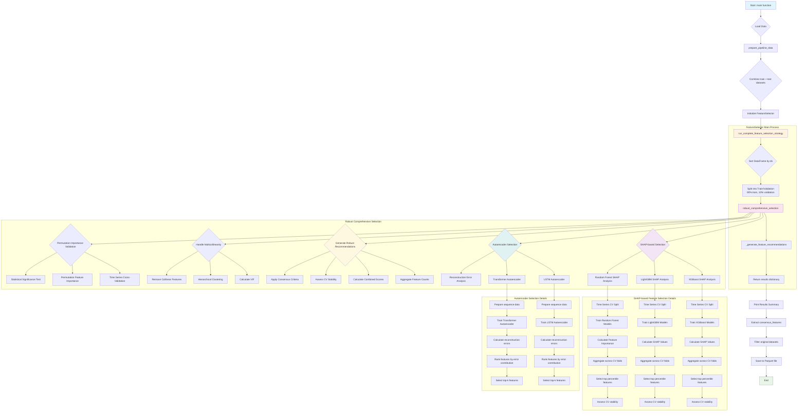

# Bitcoin Price Forecasting Feature Selection Workflow

This document provides a comprehensive workflow diagram for the feature selection strategy used in the Bitcoin price forecasting project.

## Complete Feature Selection Workflow

## Key Components Explained

### 1. Data Preparation Phase
- **Load Data**: Uses `prepare_pipeline_data()` to load training and testing datasets
- **Combine Datasets**: Temporarily combines train and test data for comprehensive feature analysis
- **Internal Splitting**: The FeatureSelector handles proper train/validation splitting internally to prevent data leakage

### 2. Robust Comprehensive Selection
This is the core of the feature selection strategy, implementing multiple complementary approaches:

#### A. SHAP-based Selection
- **XGBoost SHAP**: Tree-based model with SHAP value analysis
- **LightGBM SHAP**: Gradient boosting with SHAP interpretability
- **Random Forest SHAP**: Ensemble method with feature importance
- **Time Series CV**: Uses TimeSeriesSplit for temporal data integrity
- **Stability Assessment**: Evaluates feature consistency across CV folds

#### B. Autoencoder Selection
- **LSTM Autoencoder**: Captures temporal dependencies in feature reconstruction
- **Transformer Autoencoder**: Attention-based feature learning
- **Reconstruction Error**: Identifies features most critical for data reconstruction
- **Top-k Selection**: Selects features with highest reconstruction importance

#### C. Consensus Generation
- **Feature Aggregation**: Combines results from all selection methods
- **Scoring System**: Calculates combined importance scores
- **Stability Criteria**: Requires CV stability > 0.6
- **Consensus Threshold**: Features must be selected by ≥2 methods

### 3. Post-processing Steps

#### A. Multicollinearity Handling
- **VIF Calculation**: Identifies highly correlated features
- **Hierarchical Clustering**: Groups similar features
- **Intelligent Removal**: Keeps most important features from correlated groups

#### B. Permutation Importance Validation
- **Final Validation**: Tests selected features on held-out validation set
- **Statistical Significance**: Ensures features have meaningful predictive power
- **Robustness Check**: Confirms feature importance across multiple permutations

### 4. Output Generation
- **Results Summary**: Comprehensive analysis of feature selection process
- **Consensus Features**: Final list of recommended features
- **Data Export**: Filtered datasets saved to `data/final/final_feature_selected_data.parquet`

## Benefits of This Approach

1. **Multi-method Consensus**: Reduces selection bias by combining multiple techniques
2. **Time Series Aware**: Prevents data leakage through proper temporal splitting
3. **Robustness**: Cross-validation and stability assessments ensure reliable selections
4. **Interpretability**: SHAP values provide clear feature importance explanations
5. **Deep Learning Ready**: Autoencoder methods prepare features for neural network models
6. **Collinearity Handling**: Prevents redundant features from entering final models
7. **Validation**: Permutation importance provides final confirmation of feature utility

This comprehensive workflow ensures that only the most predictive, stable, and non-redundant features are selected for your Bitcoin price forecasting models.

